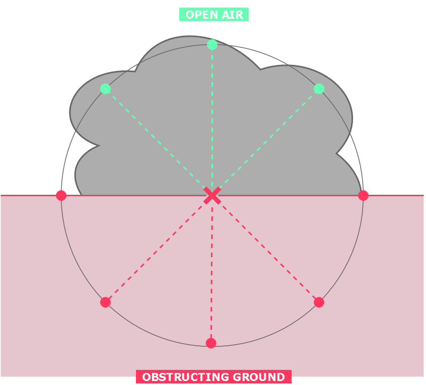

<p align="center"></p>
<h1 align="center">Smoke</h1>

<p align="center">This guide provides a basic breakdown of how to implement a smoke sphere in Minecraft using the SpigotAPI.</p>

---

## Requirements

To achieve the desired smoke effect, we need to meet the following criteria:

- **Particle Generation**: Generate particles across the surface of a sphere rather than filling the entire sphere with particles. This approach reduces the computational intensity.
- **Player Interaction**: Ensure that players who walk into the smoke region experience blindness. Conversely, players should regain visibility when leaving the smoke.
- **Mob Interaction**: When mobs enter the smoke region ~~their target should be removed~~ they will experience slowness (Constantly setting the mob target to `null` is too slow compared to the actual mob targetting event in native Minecraft). This adds complexity and depth to the smoke effect to extend to mobs as well.
- **Block Collision**: The smoke should dynamically conform to surrounding geometry by correctly colliding with obstructing blocks.

## Implementation

### Parametric Equation of a Sphere

The surface of a sphere can be described using the following [parametric equation](https://en.wikipedia.org/wiki/Sphere#Parametric):

$(x, y, z) = (\rho \cos \theta \sin \phi, \rho \sin \theta \sin \phi, \rho \cos \phi)$

where:

- $\rho$ is the **radius** of the sphere,
- $\theta \in [0, 2\pi)$ is the **longitude**,
- $\phi \in [0, \pi]$ is the **colatitude**.

We will be iterating through values of $\theta$ and $\phi$ using a set step size, generating the coordinates on the surface of a sphere with radius $\rho$, centered at $(0, 0, 0)$. These coordinates will be used to offset the center point of where we want the smoke the be placed.

We will be storing the points in a `List<Location>`.

```java
List<Location> cells = new ArrayList<>();
```

Through experimentation, I found that using the step size $\pi / 2\rho$ in our nested for loops works the best in terms of accurately depicting the surface of the sphere with appropriate spacing between points.

```java
double stepSize = PI / (2 * radius);

for (double theta = 0; theta < 2 * PI; theta += stepSize) {
	for (double phi = 0; phi <= PI; phi += stepSize) {
		double x = radius * cos(theta) * sin(phi);
		double y = radius * sin(theta) * sin(phi);
		double z = radius * cos(phi);
	}
}
```
Offsetting our center point with the surface points, we will add these coordinates into our `List`.

```java
Location point = center.clone().add(x, y, z);
World world = point.getWorld();
if (world == null) continue;
cells.add(point);
```

With this, we are left with our `getSmokeSurface(...)` function:
```java
private static List<Location> getSmokeSurface(Location center, double radius) {
	List<Location> cells = new ArrayList<>();
	double stepSize = PI / (2 * radius);
	
	for (double theta = 0; theta < 2 * PI; theta += stepSize) {
		for (double phi = 0; phi <= PI; phi += stepSize) {
			double x = radius * cos(theta) * sin(phi);
			double y = radius * sin(theta) * sin(phi);
			double z = radius * cos(phi);
			
			Location point = center.clone().add(x, y, z);
			World world = point.getWorld();
			if (world == null) continue;
			cells.add(point);
		}
	}
	return cells;
}

```

### Block Collision

With the points of our sphere surface generated, we can now begin with the logic of the smoke. We will achieve this by utilising a `BukkitTask` to cast particle effects as well as handle entity interactions at the points.

```java
private static final long PERIOD = 5;

List<Location> surface = getSmokeSurface(center, radius);
BukkitTask task = new BukkitRunnable() {
	...
}.runTaskTimer(Smoke.getInstance(), 0, PERIOD);
```

We first need to track the elapsed seconds as using the number of ticks ran each iteration of our runnable.

```java

private static final long PERIOD = 5;
private static final int TICKS_PER_SECOND = 20;

List<Location> surface = getSmokeSurface(center, radius);
BukkitTask task = new BukkitRunnable() {
	int elapsedSeconds = 0;
	long ticks = 0;
	
	@Override
	public void run() {
		if (ticks % TICKS_PER_SECOND == 0) elapsedSeconds++;
		if (elapsedSeconds >= duration) {
			cancel();
			return;
		}
		ticks += PERIOD;
	}
}.runTaskTimer(Smoke.getInstance(), 0, PERIOD);

```

Now we will begin assessing whether a surface point has block collisions between it and the center of the smoke sphere. We can achieve this using the `RayTraceResult` class with a diagram of the concept shown below:

<p align="center"></p>

Note that the `X` denotes the point in which a block collision has been detected from the bottom surface points. We will begin to code this now:

```java
private static final int PARTICLE_AMOUNT = 1;
private static final double PARTICLE_OFFSET = 0.5;
private static final double PARTICLE_SPEED = 0.01;

...

for (Location location : surface) {
	Vector direction = location.clone().subtract(center).toVector();
	RayTraceResult blockResult = world.rayTraceBlocks(center, direction, radius);

	// Lambda function to update the location from the surface to the location of the block collision.
	// We subtract the direciton as we want to position the particle just before the collision point.
	Location finalPointLocation = (blockResult != null && blockResult.getHitBlock() != null)
					? blockResult.getHitBlock().getLocation().subtract(direction)
					: location;
	world.spawnParticle(Particle.CAMPFIRE_COSY_SMOKE, finalPointLocation, PARTICLE_AMOUNT,
					PARTICLE_OFFSET, PARTICLE_OFFSET, PARTICLE_OFFSET, PARTICLE_SPEED);
}
```

### Entity Interactions

Using a similar technique for block collisions, we will cast a line from each finalised surface point to detect entities instead. [TODO]


## Contributing
Feel free to contribute to this project by submitting bug reports, feature requests, or pull requests on the [GitHub repository](https://github.com/hello-andrew-yan/spigot-smoke).

## License
This project is licensed under the [MIT License](LICENSE).

---

<p align="right"><a target="_blank" href="https://icons8.com/icons/set/smoke-grenade">Smoke Grenade</a> icon by <a target="_blank" href="https://icons8.com">Icons8</a></p>
